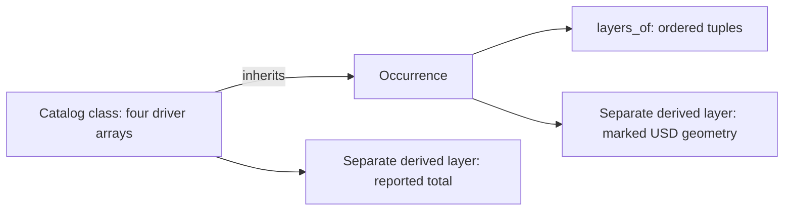

# Shared layered sections

## 1 The problem

A wall, floor, roof and ceiling can use the same layered construction. Repeating
its layer order and thicknesses on every occurrence creates disagreement when
a catalog changes. A section library makes those edits broadcast through USD
composition and gives consumers one ordered query.

## 2 The data as it arrives

Material layer sets typically supply a list of widths, functions, material
names and join priorities. Consumers map those values onto a catalog class in
exterior-to-interior order. Widths are SI metres. An observed total is a derived
result; the companion does not invent an importer or infer the construction
from a rendered body.

## 3 The model in USD

`AecoBuildUpAPI` decorates the existing catalog class beside `AecoTypeAPI`.
Four driver arrays share one index. Occurrences use `inherits`; local edits
win by ordinary composition strength. `totalThickness` is derived and carries
`aecoDerived = true` in the schema.

The API adds no referent, identity or classification vocabulary. The section
tier lies between core and consuming element libraries. Rendering uses native
USD geometry and shading, outside the section schema.

## 4 Workflow

The complete wall authoring workflow belongs to
[usdaeco-wall](https://github.com/criad-com/usdaeco-wall). This library supplies
its catalog section contract and the `aeco-buildup layers` query. Local build,
validation and preview commands are in [the README](../README.md).

## 5 Validation

| Registered rule (`usdAecoBuildUpValidators:`) | Severity | What it catches |
|---|---|---|
| BuildUpArrayLengthsChecker | error | Truncated or inconsistent parallel arrays, including class prims |
| BuildUpTotalMismatchChecker | warn | An authored total that disagrees with the sum beyond 1e-8 m, or nonfinite values |

The Python plugin wraps both existing rules and retains their evidence sites,
messages and severity behavior. Catalog traversal avoids repeating an inherited
finding for every occurrence. New ProperCase error names have compatibility
aliases for old profile keys. Built-in and core validators may be selected too.

## 6 The example on the demo data centre

The [example](../examples/datacentre/README.md) composes the complete v0.4.6
`clash` publication: 2,980 elements, 35 spaces, two levels, 6,244 ports and
3,015 meshes, checked against `dc.manifest.json`. It promotes 20 office walls
into three catalog specializations that inherit their original source types.
Existing IFC classification and type model select partition and blockwork;
spatial adjacency to the WC selects its lining specialization. No occurrence
is replaced, reparented or assigned a new identity.

The committed recipes are explicit demonstration assumptions: the publication
provides total widths, not these layer-by-layer material specifications. The
150 mm partition is 25/100/25 mm; the 200 mm blockwork is 15/170/15 mm; the
150 mm WC assembly is 25/100/15/10 mm. The WC finish faces its room. The two
blockwork walls and two examples of each partition recipe produce 20 gross
rectangular proxy bodies from resolved arrays and published dimensions.
Openings, joins and stud detail are not evaluated.

The stock render shows the facility with blue partitions, orange blockwork
and green WC lining. Its removable presentation layer hides four roof/ceiling
bodies plus 17 office facade/upper-floor bodies, retaining every source prim.
The separate exploded study shows a 1.4 by 1.8 m sample of one WC wall; only
that study changes the layer spacing. The small synthetic example remains a
quick way to understand inheritance without loading the facility.

## 7 Trade-offs and alternatives

Parallel arrays are compact and inherit without relationship traversal. Their
shared index needs explicit validation. Child layer prims would offer per-layer
identity but add structure for a section aspect; material relationships would
serve richer semantic material catalogs later. Material names here do not
replace UsdShade bindings.

Class-only applicability cannot be expressed by USD's type restriction field.
The schema explicitly declares unrestricted applicability because catalog type
prims are untyped by design. S10 passes directly; runtime applicability and the
mixed-case `aeco:buildUp:` namespace are preserved from v0.1.2. The Sdf comparison
allows only that customData declaration and its doc sentence.

## 8 Out of scope and open questions

No importer, joins, opening subtraction, thermal calculation, production wall evaluation
or material database is supplied. Negative widths, unknown functional tokens
and priority policy have no additional library-specific rule in this release.
Both rectangular previews omit openings and joins; material recipes are illustrative.
Time-varying build-ups are not validated beyond default time.

## 9 Status

Version 0.2.4 targets core v0.9.2 and toolchain v0.3.8. Schema property names,
defaults, allowed tokens, derived metadata and applicability match v0.1.2.
See [the release record](datacentre-release.md) for measured checks and deviations.
